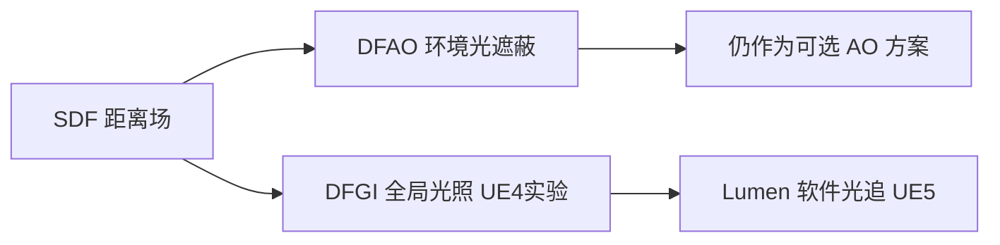
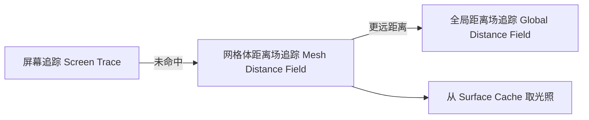

---
tags:
  - TA
  - 渲染
  - 光照
  - 距离场
  - UE5
  - Lumen
created: 2026-08-17
related:
  - "[[公式]]"
---

# DFGI 与 DFAO:距离场光照

> **一句话:DFAO(距离场环境光遮蔽)和 DFGI(距离场全局光照)都是用「有向距离场 SDF」在 3D 空间里做光线追踪的老牌技术。DFAO 至今仍是可选 AO 方案;DFGI 是 UE4 的实验性动态 GI,已被 UE5 的 Lumen 取代——而 Lumen 的「软件光线追踪」本质上就是 DFGI 思想的成熟化。**
>
> 目标读者:想做技术美术(TA·光照/渲染向)、对「距离场」这套东西还比较陌生的人。读懂这篇,你就知道 SDF 是怎么从「AO」一路用到「全局光照」的。

---

## 0. 先搞懂底层:距离场(SDF)

DFAO / DFGI 名字里都带 "Distance Field",所以先花一分钟把地基打牢。

**有向距离场(Signed Distance Field,SDF)**:空间里每个点,存一个「到最近表面的**有符号**距离」——表面内为负、表面外为正、表面上为 0。

在 UE 里有三种粒度的距离场,别混:

| 距离场 | 英文 | 作用 | 构建时机 |
|--------|------|------|----------|
| **网格体距离场** | Mesh Distance Field | 单个静态网格体自己的 SDF,存成 3D 体积纹理 | 导入/构建时预计算 |
| **全局距离场** | Global Distance Field | 把多个网格体距离场合并成「场景级」SDF,供快速查询 | 运行时合成 |
| (概念层) | Surface Cache | Lumen 里缓存光照的「表面」,不是 SDF 但配合 SDF 追踪用 | 运行时 |

> 开启入口:**项目设置 > 渲染 > 生成网格体距离场(Generate Mesh Distance Fields)**。代价是构建时间、内存、磁盘占用都变高。

**为什么要用它做光照?** 因为有了 SDF,就能用**锥体追踪(Cone Trace)/ 球体追踪(Sphere Trace)** 快速做「这条射线会不会撞到东西」的查询,比逐三角形求交快得多,而且**不依赖屏幕空间**——屏幕外的几何体照样能产生遮蔽/反弹。

---

## 1. DFAO:距离场环境光遮蔽

**Distance Field Ambient Occlusion,距离场环境光遮蔽**。一种**全动态 AO**,用网格体距离场在世界空间里算遮挡。

### 1.1 它和 SSAO 有什么不一样

| | SSAO(屏幕空间) | DFAO(距离场) |
|---|---|---|
| 采样空间 | 屏幕空间(只看得到当前画面) | 世界空间(整个场景) |
| 屏幕外遮挡物 | ❌ 丢失,产生边缘伪影 | ✅ 照样参与遮蔽 |
| 动态物体 | 能遮蔽 | 刚性网格体可移动/隐藏并影响遮蔽 |
| 依赖 | 仅深度缓冲 | 需要 SDF 数据(内存+构建成本) |
| 方向性 | 无方向(纯遮蔽) | 可算**弯曲法线 / 高光遮蔽**,方向更准 |

一句话:**SSAO 是"屏幕上的便宜近似",DFAO 是"真 3D 里的准确遮蔽"**,代价是多了距离场的存储和追踪开销。

### 1.2 怎么启用

官方标准流程:

1. 项目设置 > 渲染,勾选 **生成网格体距离场(Generate Mesh Distance Fields)**;
2. 拖一个 **天空光照(Sky Light)** 进关卡;
3. 把 Sky Light 的 **可移动性(Mobility)** 设为 **可移动(Movable)** → DFAO 自动启用。

### 1.3 关键参数(都在 Sky Light 上)

| 参数 | 作用 |
|------|------|
| **遮蔽对比度 Occlusion Contrast** | 遮蔽边缘软硬 |
| **最小遮蔽 Minimum Occlusion** | 防止内部/缝隙彻底死黑 |
| **遮蔽色调 Occlusion Tint** | 遮蔽的颜色 |
| **遮蔽最大距离 Occlusion Max Distance** | 采样射线最远探测距离 |
| **遮蔽指数 Occlusion Exponent** | 遮蔽强度非线性曲线 |

### 1.4 两个进阶点

- **弯曲法线(Bent Normal)**:DFAO 会输出「最小遮蔽方向」,用来修正**散射天空光照(diffuse)**,让天光方向更合理。
- **高光遮蔽(Specular Occlusion)**:通过定向锥与反射锥相交计算,`r.AOSpecularOcclusionMode` 可切换精度(更精确但可能有采样伪影)。

### 1.5 局限(踩坑点)

- 只支持**轻微非等分缩放**,别做极端拉伸;
- **大型网格体质量差**(体积纹理上限 128³),建议拆成模块化部件;
- 植被:需开启 **影响距离场光照(Affect Distance Field Lighting)**,建议勾 **生成两面距离场(Two-Sided Distance Field Generation)**,并提高 Min Occlusion 防内部全黑;
- LOD 可能导致过度遮蔽,远景公告板用 World Position Offset / Pixel Depth Offset 修。

---

## 2. DFGI:距离场全局光照

**Distance Field Global Illumination,距离场全局光照**。UE4 时代的**实验性动态 GI** 方案——用距离场做软件光线追踪,模拟间接光反弹。

**重要结论:它已经被弃用了。** Epic 官方把 DFGI 归入「被 Lumen 取代的旧技术」名单,和它一起退役的还有:

- LPV(光传播体积 Light Propagation Volumes)
- SSGI(屏幕空间全局光照)
- 独立的 Ray Traced GI(`RAY_TRACED` 方法)

> ⚠️ 所以「DFGI」这个词现在有两种用法,注意区分:
> 1. **严格含义**:UE4 那个具体的实验性功能(基本没人再用了);
> 2. **宽泛含义**:「用距离场做全局光照」这一类方法——按这个理解,UE5 里它的**继任者就是 Lumen 的软件光追**。

---

## 3. 与 Lumen 的关系:DFGI 思想的「转正」

Lumen 有两种光追模式,关键就在第一种:

| Lumen 模式 | 用什么 | 说明 |
|------------|--------|------|
| **软件光线追踪 Software Ray Tracing** | **网格体距离场 / SDF** | 无需 RT 核,硬件兼容面最广,就是 DFGI 的成熟版 |
| 硬件光线追踪 Hardware Ray Tracing | 真实三角形 | 质量更高,需要 RTX 2000+/RX 6000+,UE5.5 起是默认推荐 |

Lumen 的追踪是**分层回退**的:

- 先试**屏幕追踪**(便宜,但只有屏幕内有效);
- 未命中再落到**网格体距离场追踪**(能处理屏幕外);
- 更远距离切成**全局距离场追踪**(更省);
- 命中后从 **Surface Cache** 取光照信息。

所以理解 DFGI,就理解了 Lumen 软件光追的「前传」——**思想一脉相承,只是 Lumen 把 Surface Cache、屏幕追踪、多分辨率等工程细节补全了**。

---

## 4. 一张表收尾:DFAO vs DFGI vs Lumen

| | DFAO | DFGI(UE4) | Lumen(UE5) |
|---|---|---|---|
| 解决什么 | 环境光遮蔽 | 动态全局光照 | 动态 GI + 反射(一整套) |
| 状态 | ✅ 仍可用 | ❌ 已弃用 | ✅ 推荐 |
| 底层 | SDF | SDF | SDF(软件) / 三角形(硬件) |
| 依赖 | Mesh Distance Field | Mesh Distance Field | Mesh Distance Field + Surface Cache |
| 记忆点 | 「用 SDF 算影子」 | 「用 SDF 算反弹」的雏形 | 「SDF 反弹」的完全体 |

---

## 5. 排查/调试速查

- 可视化纯 DFAO:**显示 > 可视化 > Distance Fields Ambient Occlusion**(此模式下只有 Occlusion Max Distance 生效);
- 可视化距离场:**显示 > 可视化 > Mesh Distance Fields / Global Distance Field**;
- `r.AOUseHistory` / `r.AOUseJitter`:AO 的时间滤波与抖动,关掉历史可减少拖影但会闪;
- `r.AOUpdateGlobalDistanceField`:调试用,控制全局距离场是否更新;
- 动态分辨率下 DFAO 出现角色残影(UE5.6–5.7 已知问题):临时 `r.AOUseHistory=0`,代价是闪烁。

---

## 参考

- [Using Distance Field Ambient Occlusion — Epic 官方文档](https://dev.epicgames.com/documentation/unreal-engine/using-distance-field-ambient-occlusion-in-unreal-engine)
- [Mesh Distance Fields — Epic 官方文档](https://dev.epicgames.com/documentation/unreal-engine/mesh-distance-fields-in-unreal-engine)
- [Lumen 技术细节(软件/硬件光追 + Surface Cache)— Epic 官方文档](https://dev.epicgames.com/documentation/unreal-engine/lumen-technical-details-in-unreal-engine)
- [Lumen 全局光照与反射 — Epic 官方文档](https://dev.epicgames.com/documentation/unreal-engine/lumen-global-illumination-and-reflections-in-unreal-engine)
